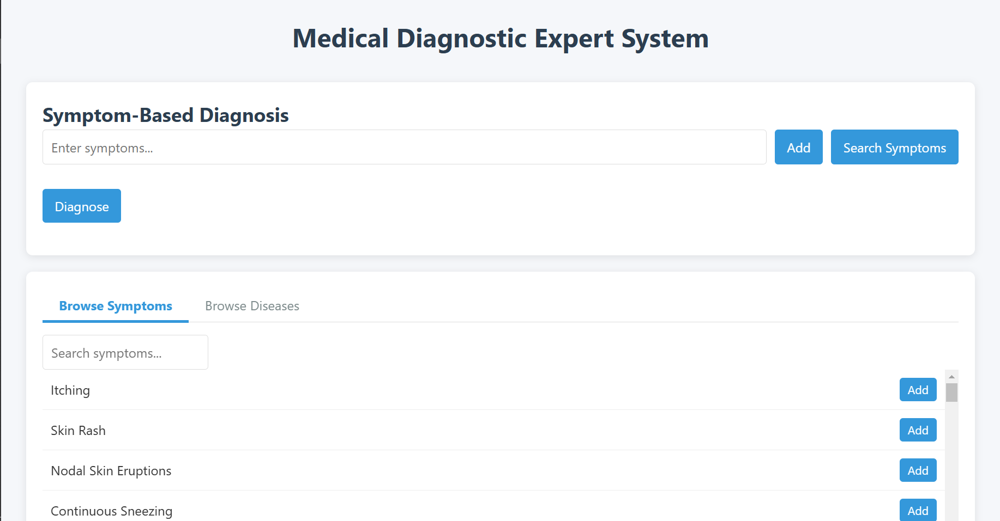

# Medical Diagnostic Expert System




A web-based expert system for diagnosing medical conditions based on symptom patterns.

## Features
- Symptom-based diagnosis with confidence scoring
- Disease information browser
- Interactive web interface
- Knowledge base powered by `medical_knowledge.json`

## Technologies
- Python (Flask backend)
- HTML/CSS/JavaScript (Frontend)
- Medical knowledge engineering

## Setup
1. **Clone the repository**:
   ```bash
   git clone https://github.com/AdityaKapare03/Medical-Expert-System.git
   cd Medical-Expert-System
   ```

2. **Install dependencies**:
   ```bash
   pip install -r requirements.txt
   ```

3. **Run the system**:
   ```bash
   python app.py
   ```
   Access at: `http://localhost:5000`

## Knowledge Base Structure
```json
{
  "diseases": {
    "DiseaseName": {
      "description": "...",
      "symptom_patterns": [...],
      "precautions": [...]
    }
  },
  "symptom_severity": {
    "symptom_name": severity_score
  }
}
```

## Troubleshooting
- **Port in use**: Try `python app.py --port 5001`
- **Missing dependencies**: Run `pip install --upgrade -r requirements.txt`

## License
[MIT License](LICENSE)